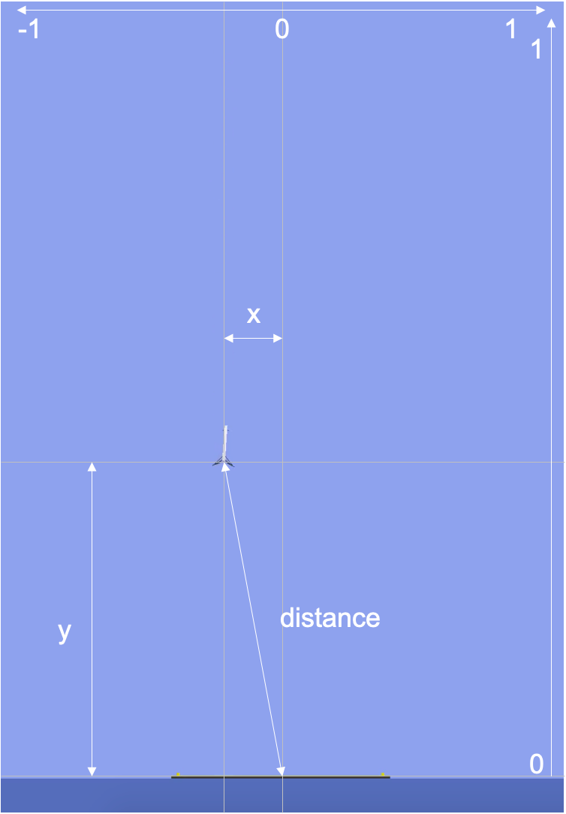
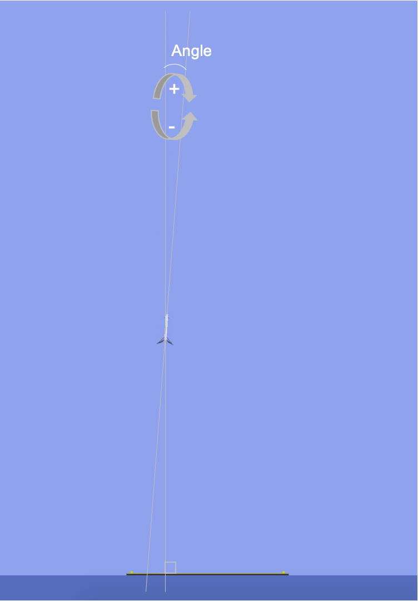
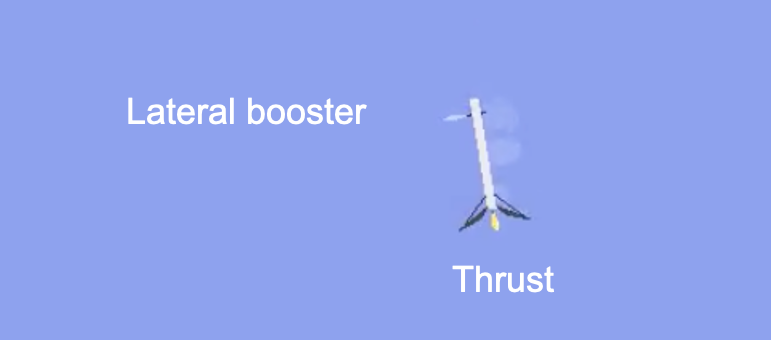
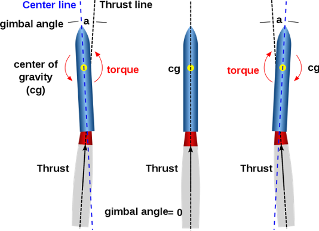

This repository contains the materials necessary for the ending Hackathon for the **2020 RL@XHEC course**.

The goal is for the students to define the rewards and train&tweak the agent to achieve the best score possible.

**How-to use it:**
1. Clone this repository : `git clone https://gitlab.com/the_insighters/x-hec/hackathon-rlxhec.git`
2. Enter the repo folder `cd hackathon-rlxhec`
3. (Optional if already done) : install poetry `curl -sSL https://raw.githubusercontent.com/python-poetry/poetry/master/get-poetry.py | python -`
4. Install the libraries : `poetry install`
5. You can now run main.py using poetry: `poetry run python main.py`
6. Modify main.py to tweak the agent and reward.
7. Good luck !

**To-do list**
- [x] Transform the Rocker lander from https://github.com/EmbersArc/gym_rocketLander/blob/master/gym/envs/box2d/rocket_lander.py into an exploitable environment.
- [x] Customize the environment for the reward function to be definable from main.py
- [x] Create a nice training&testing interface
- [X] Add a save Agent functionnality
- [X] Solve the task with PPO)
- [x] Add video recording (instead of just being able to watch the episode at the time it is done)
- [X] Add a cue when the task is "solved"
- [X] Add landed and landed full to available variables
- [x] Add difficulty levels (done but not very useful, maybe a score system will be beter)
- [x] Add score
- [x] Add variables description
- [ ] Tweak the difficulty for a nice experience
- [ ] Test the exercise with different people to measure difficulty and time to beat

**Architecture:**
- main.py : This is where the student will define reward function and agent and will be able to train and see the results
- utils.py : Scripts to help the students. non directly related to RL.
- gym_rocketLander (submodule) : Custom gym environment for SpaceX Rocket Lander (original work from EmbersArc modified to tweak difficulty)
- requirements.txt : Specifies the needed libraries
- .gitignore : Specifies which files to ignore when commiting.
- data (folder):  stores the data needed for the plots and agent. It is of no use for the user
- figs (folder): stores the graphs (rewards over the episodes)
- vids (folder): stores the vids of the agent's execution for each batch

**Variable explanation**

**Disclaimer:**
The environment is based on https://github.com/EmbersArc/gym_rocketLander

